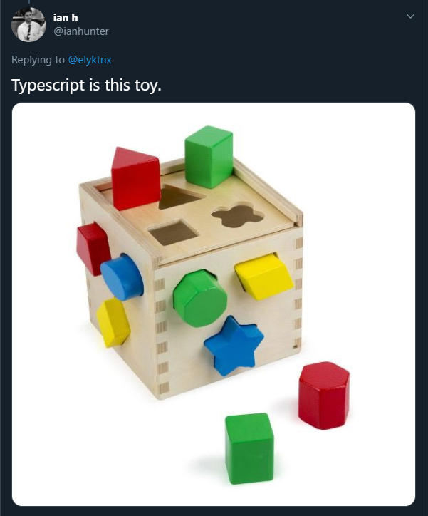

# Introdução

## O que é o TypeScript?

<p align="center">
  <a href="https://twitter.com/ianhunter/status/1258209274347638787" target="_blank">
    
  </a>
</p>

<p align="center">
Escrito na imagem: "TypeScript é como esse brinquedo."
</p>

TypeScript é considerado um **superset** da linguagem JavaScript, dito isso, se você já sabe JavaScript é muito fácil de começar a usá-lo já sabendo um pouco.
Ele tem como  principal funcionalidade a capacidade de adicionar **tipagens estáticas** ao código.
Um dos pontos positivos que vale a pena ser citado é a possibilidade de termos arquivos TypeScript convivendo no mesmo projeto com arquivos JavaScript já que no final das contas o TypeScript é compilado para JavaScript, ou seja, é uma ferramenta de **desenvolvimento**. Isso também permite que você adicione TypeScript em qualquer momento do seu projeto, conforme necessidade e gosto pessoal.

### Por que usar TypeScript?

O uso de TypeScript traz segurança principalmente na detecção de **erros inesperados**. Um exemplo clássico seria o problema do operador `+` do JavaScript que, dada uma soma com tipagens erradas poderia retornar erroneamente uma **concatenação** ao invés da soma propriamente dita.

```ts
function soma(x, y) {
  return x + y;
}
```

Chamando a função `soma(2,2)` o retorno seria `4`;

Chamando a função `soma('2','2')` o retorno seria `22`;

Esse problema seria facilmente evitado ao tiparmos as variáveis corretamente como números.

---

Outra grande vantagem de usar o TypeScript é o aumento da inteligência dentro do seu editor ou IDE, o famoso **[IntelliSense](https://code.visualstudio.com/docs/editor/intellisense)** e a possibilidade de usar **parâmetros opcionais**. Além disso, as tipagens podem funcionar como uma mini documentação dentro do seu arquivo, facilitando futuras manutenções e fazendo com que todos esses fatores tragam uma camada a mais de segurança para o código.

### Por que não usar apenas PropTypes?

Apesar de ser considerado uma alterativa ao TypeScript, o PropTypes é uma biblioteca que só faz a checagem de tipos em _props_ de componentes **React.js**. Isso torna muito difícil a comparação com o TypeScript que, por ser um _superset_ do JavaScript, adiciona recursos a linguagem e conta uma checagem de tipos muito mais poderosa, onde podemos checar das variáveis, aos objetos, funções, classes etc.

Porém se desconsiderarmos as limitações do PropTypes, existem outras diferenças importantes. Como:
1. O momento em que a checagem de tipos acontece;
2. A severidade com que os erros são tratados;
3. A forma como declaramos os estruturas/esquemas com os tipos;

O PropTypes faz a checagem de tipos em tempo de execução (quando a aplicação está _rodando_, sendo executada) e os erros são tratados apenas como alertas (_warnings_). Isso torna a checagem de tipos passíva e fácil de ser ignorada pelo desenvolvedor, o que pode resultar em falhas e _bugs_. Enquanto no TypeScript a checagem de tipos acontece em tempo de compilação (quando o código-fonte em TypeScript é compilado para JavaScript) e é possível configurar no `tsconfig.json` o comportamento em caso de erros, se mais permissivo ou menos dependendo do projeto.

No PropTypes contratos (estruturas/esquemas com os tipos) das _props_ de um componente **React.js** são declarados usando um objeto, que é atribuído a propriedade estática `propTypes` e usa propriedades e métodos exportados pela biblioteca `prop-types`. Esses objetos acabam tendo um impacto na performance e no tamanho da aplicação. Enquanto no TypeScript usamos `type` ou `interface` para declarar os contratos de objetos, e isso também vale para _props_ de componentes **React.js**. Ao compilar para JavaScript esses tipos e interfaces são simplesmente omitidos e não tem impacto na performance ou no tamanho da aplicação.

<table>
<thead>
<tr>
<th>
PropTypes
</th>
<th>
TypeScript
</th>
</tr>
</thead>
<tbody>
<tr>
<td>

```js
import PropTypes from 'prop-types';

function Button(props) {
  // ...
}

Button.propTypes = {
  type: PropTypes.oneOf(
    ['button', 'reset', 'submit']
  ).isRequired,
  text: PropTypes.string.isRequired
};
```

</td>
<td>

```ts
type Props = {
  type: 'button' | 'reset' | 'submit';
  text: string;
};

function Button(props: Props) {
  // ...
}
```

</td>
</tr>
</tbody>
</table>

---

<p align="center">
  <a href="https://github.com/Carolis/typescript4noobs#roadmap">VOLTAR PARA O MENU PRINCIPAL</a>
</p>
