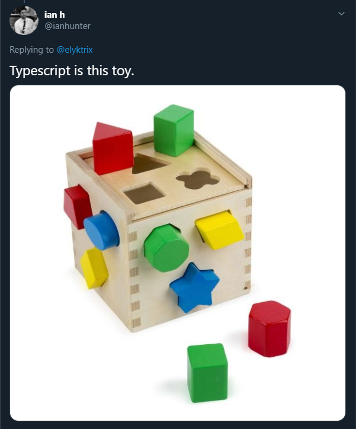

# Introdução

## O que é o TypeScript?

<p align="center">
  <a href="https://twitter.com/ianhunter/status/1258209274347638787" target="_blank">
    
  </a>
</p>

<p align="center">
Escrito na imagem: "TypeScript é como esse brinquedo."
</p>

TypeScript é um **superset** do JavaScript — se você já conhece JS, começar é bem natural. Sua principal função é adicionar **tipagens estáticas** ao código.

Arquivos `.ts` e `.js` podem conviver no mesmo projeto. O TypeScript **analisa e valida** tudo em tempo de desenvolvimento e, se precisar, também **emite** JavaScript — embora muitos projetos hoje deixem essa parte para ferramentas como Vite ou esbuild. Os tipos existem só enquanto você desenvolve: não vão para produção. Por isso dá para adotar TypeScript aos poucos, no seu ritmo.

### TypeScript 7: reescrito e muito mais rápido

A versão atual da linguagem é a **7.0.2**. Uma das maiores mudanças dessa geração foi a **reescrita completa do compilador**: o TypeScript deixou de ser implementado em TypeScript/JavaScript e passou a ser um **compilador nativo escrito em Go**.

Essa reescrita trouxe ganhos expressivos de performance. Em projetos reais de grande porte, a checagem de tipos costuma ficar entre **8 e 12 vezes mais rápida** do que na versão anterior na prática, algo em torno de **10x mais rápido**. Isso vale tanto para o comando `tsc` quanto para a experiência no editor: autocomplete, diagnósticos e outras funcionalidades do IntelliSense respondem bem mais rápido, o que deixa o fluxo de desenvolvimento mais fluido no dia a dia.

### Por que usar TypeScript?

O TypeScript funciona como um **assistente que revisa seu código enquanto você escreve**. Ele avisa sobre erros de digitação, tipos incompatíveis e uso incorreto de variáveis tudo **antes** do código chegar ao usuário final. A única diferença visível em relação ao JavaScript é que o arquivo passa a ter extensão `.ts`; o resto continua sendo JavaScript normal, com anotações de tipo por cima.

Veja alguns exemplos do que isso muda na prática.

#### Erros em funções

Um caso clássico é o operador `+` do JavaScript: com tipos errados, ele concatena em vez de somar.

Em **JavaScript puro**, o erro só aparece quando o código é executado:

```js
function soma(x, y) {
  return x + y;
}

soma(2, 2);       // 4 ✓
soma('2', '2');   // "22" — resultado errado, sem nenhum aviso
```

Com **TypeScript**, basta indicar que os parâmetros são números:

```ts
function soma(x: number, y: number) {
  return x + y;
}

soma(2, 2);       // 4 ✓
soma('2', '2');   // ❌ erro: não dá para passar texto onde se espera número
```


#### Erros de digitação em objetos

Erros bobos de digitação também passam despercebidos no JavaScript:

```js
const usuario = {
  nome: "Ana",
  email: "ana@email.com",
  idade: 25
};

console.log(usuario.email);  // "ana@email.com" ✓
console.log(usuario.emial);  // undefined — o erro passa despercebido
```

No TypeScript, o compilador **entende** o formato do objeto e aponta o problema na hora:

```ts
const usuario = {
  nome: "Ana",
  email: "ana@email.com",
  idade: 25
};

console.log(usuario.email);  // "ana@email.com" ✓
console.log(usuario.emial);  // ❌ erro: a propriedade 'emial' não existe
```


#### Variáveis com tipo definido

Você também pode declarar explicitamente o tipo de uma variável:

```ts
let idade: number = 25;

idade = 30;       // ✓ ok
idade = "trinta"; // ❌ erro: não dá para colocar texto onde se espera número
```

No JavaScript, `idade = "trinta"` funcionaria sem aviso — e o bug só apareceria depois, em algum cálculo ou comparação.

#### IntelliSense e documentação viva

Além de prevenir erros, o TypeScript aumenta a inteligência do seu editor ou IDE, o famoso **[IntelliSense](https://code.visualstudio.com/docs/editor/intellisense)**. Com tipos definidos, o editor passa a sugerir automaticamente nomes de propriedades, parâmetros e props — inclusive opcionais  enquanto você digita. As tipagens também funcionam como uma mini documentação dentro do arquivo, facilitando manutenções futuras.

Desde o TypeScript 6, o modo `strict` (que inclui essas proteções) vem **ligado por padrão**. Quanto maior o projeto, mais o TypeScript compensa — e tudo isso **não vai para produção**: os tipos são removidos na saída final, sem impacto em performance.

---

[VOLTAR PARA O MENU PRINCIPAL](https://github.com/Carolis/typescript4noobs#roadmap)