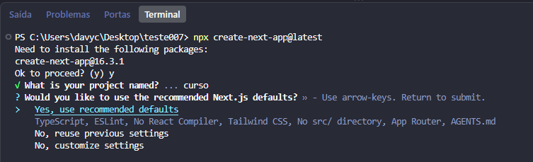

# Instalando o TypeScript

Antes de instalar o TypeScript, você precisa ter o **[Node.js](https://nodejs.org/)** instalado na sua máquina — o requisito mínimo depende da versão do TypeScript (veja [Requisito de Node.js](#requisito-de-nodejs)).

> **Dica:** na prática, muita gente nem instala o TypeScript manualmente. Ao criar um projeto com **React** (Vite), **Next.js** ou **React Native**, o TypeScript já aparece como opção durante a instalação — basta aceitar quando o terminal perguntar. No Next.js, por exemplo, a opção **"Yes, use recommended defaults"** já inclui TypeScript, ESLint, Tailwind CSS e App Router.

<p align="center">
  
</p>

<p align="center">
Na imagem: ao rodar <code>npx create-next-app@latest</code>, a opção de defaults recomendados já inclui TypeScript.
</p>

---

## Requisito de Node.js

O Node.js exigido varia conforme a versão do TypeScript que você for usar:

- **TypeScript 6.x:** Node.js **18.0** ou superior
- **TypeScript 7.x:** Node.js **20.0** ou superior (recomendado: Node **20** ou **22** LTS)

Para checar sua versão:

```bash
node -v
```

Se você está começando um projeto novo com **TS 7.x**, instale Node **20+**. Se estiver em um projeto legado com **TS 6.x**, Node **18+** já é suficiente.

---

## Qual versão instalar?

Recomendamos sempre instalar a versão mais recente e estável do TypeScript:

```bash
# Instalação padrão (versão mais recente - TS 7.x)
npm install -D typescript
yarn add -D typescript
pnpm add -D typescript

# Para fixar na versão 6.x (se o projeto legado exigir)
npm install -D typescript@6
yarn add -D typescript@6
pnpm add -D typescript@6
```

### Entendendo as versões (TS 6 vs TS 7)

- **TypeScript 6.x:** Lançado em março de 2026, foi a última versão baseada na arquitetura clássica em JavaScript. Ela serve como ponte para remover configs legadas (como ES5 e `baseUrl`).
- **TypeScript 7.x:** A versão atual e **recomendada para qualquer projeto novo**.

---

## Instalação manual (por projeto)

A forma recomendada é instalar o TypeScript **dentro de cada projeto**, não globalmente. Assim, todo mundo na equipe usa a mesma versão.

**1.** Crie ou entre na pasta do projeto e inicialize o gerenciador de pacotes (se ainda não tiver):

```bash
npm init -y        # npm
yarn init -y       # yarn
pnpm init          # pnpm
```

**2.** Instale o TypeScript usando um dos comandos da seção [Qual versão instalar?](#qual-versão-instalar) — escolha **TS 7.x** para projetos novos ou **TS 6.x** se o projeto legado exigir.

**3.** Verifique se instalou corretamente:

```bash
npx tsc -v
```

**4.** Gere o arquivo `tsconfig.json` (configuração do TypeScript no projeto):

```bash
npx tsc --init
```

Esse arquivo define como o TypeScript se comporta: quão rigoroso ele é com erros, quais pastas analisar, qual versão do JavaScript emitir (quando necessário), etc. Em projetos modernos, muitas vezes o TypeScript só **checa tipos** e ferramentas como Vite ou esbuild cuidam de transformar o código.

---

## TypeScript + React (Vite)

Ao criar um projeto React, o TypeScript já pode ser incluído pelo template. Com o **Vite**:

#### npm

```bash
npm create vite@latest my-tsreact-app -- --template react-ts
```


#### yarn

```bash
yarn create vite my-tsreact-app --template react-ts
```


#### pnpm

```bash
pnpm create vite my-tsreact-app --template react-ts
```


### TypeScript + Next.js

No **Next.js**, o TypeScript vem nas opções recomendadas ao rodar:

```bash
npx create-next-app@latest
```

O assistente interativo pergunta se você quer usar os defaults recomendados — e eles já incluem **TypeScript**. Também dá para personalizar e marcar TypeScript manualmente em **"No, customize settings"**.

Exemplo de componente funcional com TypeScript (padrão atual):

```ts
import { useState } from 'react'

interface Props {
  message: string
}

function App({ message }: Props) {
  const [hasMessage, setHasMessage] = useState(false)
  return <p>{hasMessage ? message : 'Default Message'}</p>
}

export default App
```

---


## TypeScript + React Native

Desde o React Native **0.71**, novos projetos já vêm com TypeScript por padrão — não é mais necessário usar um template separado.

```bash
npx @react-native-community/cli@latest init MyApp
```

O template antigo `react-native-template-typescript` está **deprecado**. Se preferir **Expo**, também há suporte nativo a TypeScript — basta adicionar um arquivo `.ts` ou `.tsx` que o Expo configura automaticamente.

---

[VOLTAR PARA O MENU PRINCIPAL](https://github.com/Carolis/typescript4noobs#roadmap)