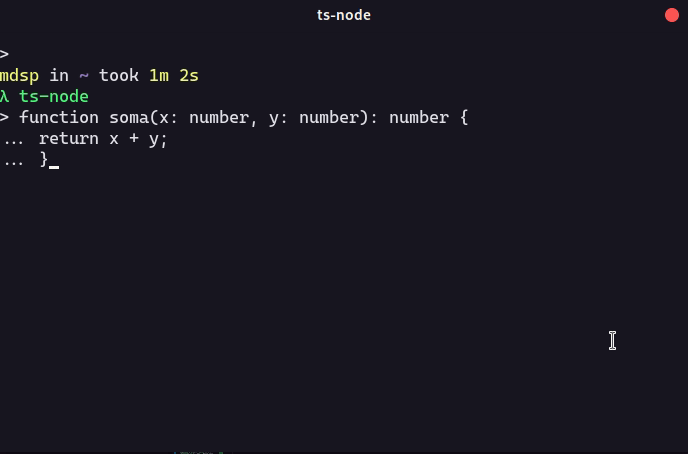
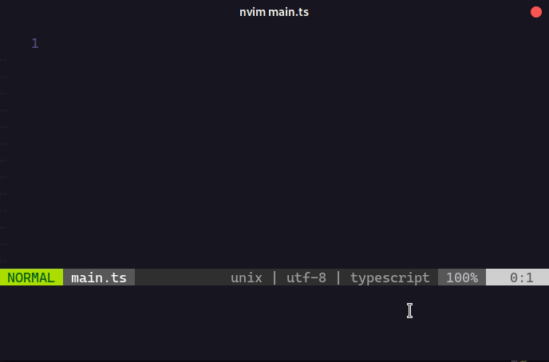

# Mão na Massa: Tipando variáveis e Retorno de Funções

Tipar variáveis é bem simples, como demonstrado no exemplo abaixo basta que você adicione `:tipo` depois de uma variável.

Exemplos:

```ts
let numero: number
numero = 3

let isTrue: boolean
isTrue = true
```

Para começar, vamos corrigir o exemplo da soma demonstrada na seção introdutória:

```ts
function soma(x: number, y: number) {
  return x + y;
}
```

Adicionando `:number` na frente das variáveis o problema da concatenação não desejada já seria facilmente eliminado.

<div align='center'>
  
</div>

---

Mas você já pensou em tipar uma função? Bem, não é exatamente isso, mas em TypeScript é possível tipar o retorno de uma função!

Isso permite ter a segurança que uma função irá retornar determinado tipo, por exemplo:

```ts
const somar10 = (n: number): number => n + 10;

function resposta(): string {
  return 'sim!';
}
```

Como demonstrado acima, tipar o retorno de uma função é parecido com tipar uma variável: apenas coloque um `:tipo`, porém depois dos parênteses.

Caso o tipo retornado não corresponda com o tipo do retorno:

<div align='center'>
  
</div>

Dessa forma seremos alertados com um erro.

---

<p align="center">
  <a href="https://github.com/Carolis/typescript4noobs#roadmap">VOLTAR PARA O MENU PRINCIPAL</a>
</p>
